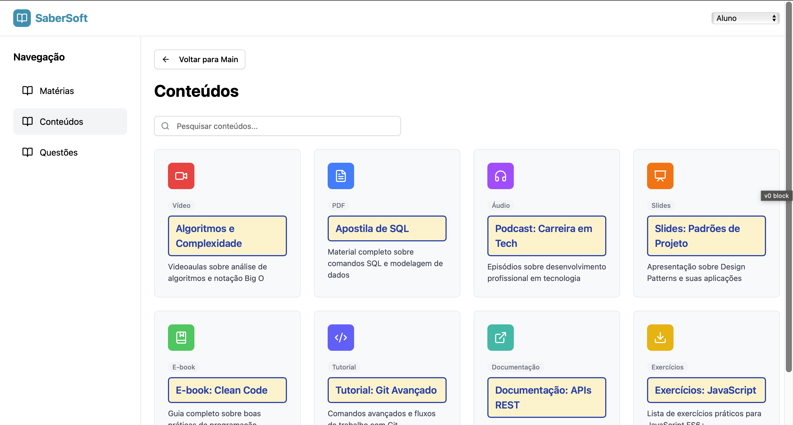

# Protótipo e Design de UI/UX

Esta seção apresenta o protótipo do sistema SaberSoft, desenvolvido com a ferramenta **V0**. O protótipo serve como uma representação visual das principais funcionalidades e fluxos de usuário da plataforma antes do início da fase de desenvolvimento.

O objetivo é ilustrar a experiência do usuário (UX) e o design da interface (UI), mostrando como o Aluno e o Administrador irão interagir com o sistema. Ele inclui telas-chave, como o dashboard do aluno, o sistema de filtragem de questões e as áreas de gerenciamento de conteúdo.

## Telas do Protótipo

Abaixo, você pode ver as principais telas do protótipo que criamos para o projeto SaberSoft.

### Tela de Inicio

### Tela de Acesso e Autenticação

### Dashboard do Aluno

### Página de Questões e Filtros dos Alunos

### Página de Conteúdos dos Alunos

### Página de Matérias dos Alunos

### Dashboard Administrativo

### Matéria Administrativo

### Conteúdo Administrativo

### Questões Administrativo

